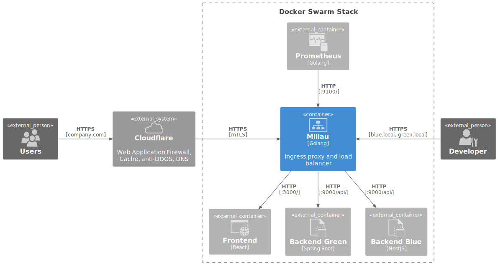

# Millau
Millau (pronounced _mijo_) is a free ingress proxy and load balancer designed for microservice architectures built on Docker Swarm.



Traditional proxies require configuration for each path and host, and must be restarted to apply changes. Modern proxies listen to Docker events and configure routes automatically. While traditional proxies store configuration files on mounted volumes, modern proxies store routes in memory. However, modern proxies do not support load balancing across services - Millau does.

Millau
- Listens to Docker events for zero restarts
- Failover retries for guaranteed delivery
- Written in Golang and available as a slim Docker image

## Comparison

| Product    | Configuration | Multi-service LB | Service discovery | Prometheus metrics | mTLS    | Image size, MB |
|------------|---------------|------------------|-------------------|--------------------|---------|----------------|
| NGINX      | File          | Yes              | No                | No                 | Yes     | 192            |
| HAProxy    | File          | Yes              | No                | Yes                | Yes     | 105            |
| Envoy      | File          | Yes              | No                | Yes                | Yes     | 191            |
| Caddy      | File          | Yes              | No                | Yes                | Yes     | 49             |
| Traefik    | Labels        | No               | Yes               | Yes                | Yes     | 224            |
| **Millau** | **Labels**    | **Yes**          | **Yes**           | **No**             | **Yes** | **27**         |

## Performance

| Product    | Test type                         | Avg response (ms) | Shortest response (ms) |
|------------|-----------------------------------|-------------------|------------------------|
| NGINX      | GET application/json              | 2.45              | 1.73                   |
| HAProxy    | GET application/json              | 2.99              | 1.93                   |
| Caddy      | GET application/json              | 2.80              | 1.66                   |
| Traefik    | GET application/json              | 2.66              | 1.53                   |
| **Millau** | GET application/json              | **2.76**          | **1.74**               |
| NGINX      | POST application/octet-stream 5Mb | 32.24             | 29.27                  |
| HAProxy    | POST application/octet-stream 5Mb | 23.12             | 20.69                  |
| Caddy      | POST application/octet-stream 5Mb | 23.81             | 20.98                  |
| Traefik    | POST application/octet-stream 5Mb | 23.35             | 21.04                  |
| **Millau** | POST application/octet-stream 5Mb | **22.86**         | **20.53**              |

## Quickstart

1. Create `docker-compose.proxy.yml`:
    ```
    services:
      proxy:
        image: codelev/millau:latest
        volumes:
          - /var/run/docker.sock:/var/run/docker.sock:ro
        ports:
          - "8080:80"
        networks:
          - millau
    networks:
      millau:
        external: true
    ```
2. Create `docker-compose.service.yml`:
    ```
    services:
      whoami:
        image: traefik/whoami
        deploy:
          mode: replicated
          replicas: 3
          labels:
            - "millau.enabled=true"
            - "millau.port=80"
        ports:
          - "80"
        networks:
          - millau
    networks:
      millau:
        external: true
    ```
3. Create network: `docker network create --driver=overlay millau`
4. Deploy proxy: `docker stack deploy -c docker-compose.proxy.yml proxy`
5. Deploy service:  `docker stack deploy -c docker-compose.service.yml service`

## Use Cases

### Blue-Green

```shell
docker stack deploy -c docker-compose.bluegreen.yml bluegreen
curl -i -H 'Host: company.com' localhost:8080/api/
# HTTP 200 blue or green
curl -i -H 'Host: green.local' localhost:8080/api/
# HTTP 200 green
curl -i -H 'Host: blue.local' localhost:8080/api/
# HTTP 200 blue
curl -i -H 'Host: company.locall' localhost:8080
# HTTP 502 No matching services found
curl -i -H 'Host: company.local' localhost:8080/apii/
# HTTP 502 No matching services found
curl -k --resolve company.local:8443:127.0.0.1 --connect-to company.local:8443 -H 'Host: company.local' https://company.local:8443/api/
# HTTP 200 blue or green
docker stack rm bluegreen
```

### Ingress

```shell
docker stack deploy -c docker-compose.ingress.yml ingress
curl -i localhost:8080
# HTTP 200 backend
docker stack rm ingress
```

### Failover

```shell
docker stack deploy -c docker-compose.failover.yml failover
curl localhost:8080/rest/echo
# HTTP 200
docker stack rm failover
```

### Docker Compose

```shell
docker compose up -d
curl -i localhost:8080/rest/echo
# HTTP 200
curl -k --resolve company.local:8443:127.0.0.1 --connect-to company.local:8443 https://company.local:8443/rest/echo
# HTTP 200
docker compose down
```

### Self-Signed TLS Certificate

```shell
openssl genrsa -out company.local.key 2048
openssl req -new -key company.local.key -out company.local.csr
openssl x509 -req -days 365 -in company.local.csr -signkey company.local.key -out company.local.cert
base64 -w 0 company.local.key > company.local.key.b64
base64 -w 0 company.local.cert > company.local.cert.b64
```

## Configuration

### Logging Levels

- **FATAL**: Indicates an unrecoverable error; the process will exit.
- **ERROR**: Indicates a proxy failure; the process continues running.
- **WARN**: Indicates client or microservice misbehavior; the process continues running.
- **INFO**: Indicates normal functional behavior. Default level.
- **DEBUG**: Indicates step‑by‑step functional behavior.

 ```
 services:
   proxy:
     image: codelev/millau:latest
      environment:
        - LOGGING=DEBUG
      ...
 ```

### HTTP and HTTPS Ports
By default, the HTTP and HTTPS ports are `80` and `443`. You can change them as follows:

 ```
 services:
   proxy:
     image: codelev/millau:latest
      environment:
        - HTTP=8080
        - HTTPS=8443
      ...
 ```

### HTTP Path Matching
The matching logic selects the services whose `millau.path` label matches the beginning of the request path. It prioritizes:
1. Specific path rules matches only that exact file.
2. Exact or longest prefix matches.
3. Handling of trailing slashes and partial matches.

| Configured services              | HTTP Path          | Selected services |
|----------------------------------|--------------------|-------------------|
| `/api/` `/`                      | `/api/`            | `/api/`           |
| `/api/` `/`                      | `/api`             | `/`               |
| `/api/` `/`                      | `/file.html`       | `/`               |
| `/api/` `/`                      | `/api/`            | `/api/`           |
| `/api/` `/`                      | `/api/x`           | `/api/`           |
| `/api/` `/`                      | `/api/x/`          | `/api/`           |
| `/api/` `/`                      | `/api/x/file.html` | `/api/`           |
| `/api/` `/` `/file.html`         | `/file.html`       | `/file.html`      |
| `/file` `/api/` `/` `/file`      | `/file.html`       | `/file` `/file`   |
| `/api/` `/` `/file` `/file.html` | `/file.html`       | `/file.html`      |
| `/api/` `/` `/api/`              | `/api/`            | `/api/` `/api/`   |


### Free Commercial License
Adding a license key to your Millau instance removes debugging information from HTTP traffic. You can get the license free of charge in a minute at https://millau.net/license and add it as follows:

 ```
 services:
   proxy:
     image: codelev/millau:latest
      environment:
        - LICENSE=my-license-key
      ...
 ```

## Support
The license key also gives you access to support. Feel free to send a message or schedule a call at https://millau.net/support.

Please note that Millau is a non-commercial project, so constant availability isn't guaranteed. However, you're always welcome to report issues on GitHub https://github.com/codelev/millau/issues.

## Contributing
There are three ways you can support Millau:
1. Use Millau in your stack.
2. Sponsor at https://www.patreon.com/c/millau
3. Star this GitHub repository.

Every user, issued license, and star helps attract the attention of potential investors. The final goal is to raise €20,000 to establish Millau as the standard ingress proxy for Docker Swarm and release it under an open-source license.
